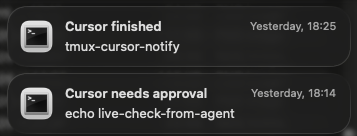

# tmux-agent-notify

macOS notifications for agentic CLIs running in tmux. Get a ping when a turn finishes or when the agent is waiting for you, then click the notification to jump back to the right pane. Cursor (`agent`) and Claude Code (`claude`) are supported; Codex is planned.



The screenshot shows Cursor notifications. Claude Code's look the same, with the titles below.

## What you get

Cursor:

| Notification | When | Body |
| --- | --- | --- |
| **Cursor needs approval** | The CLI shows an approval card for a shell command or MCP tool | The command |
| **Cursor finished** | A turn completes | The workspace folder |
| **Cursor hit an error** | A turn ends with an error | The workspace folder |

Claude Code:

| Notification | When | Body |
| --- | --- | --- |
| **Claude is waiting for you** | Claude Code asks for permission or asks you a question | The folder |
| **Claude finished** | A turn completes | The folder |
| **Claude hit an error** | A turn ends with an error | The folder |

Nothing is sent when you are already looking at the pane (terminal in front, that pane visible), when you interrupt a turn, or when the agent is not running in tmux.

If a prompt appears while you are looking and you switch away without answering it, you are notified at that moment. Once you have answered, switching away is silent.

Clicking a notification brings the terminal forward and selects the pane. Notifications for one session replace each other, so "finished" takes the place of an earlier approval notification.

## How it works

Every hook runs `bin/notify <agent> <event>`. A small adapter per agent, in `bin/agents/`, reads the hook's payload and says whether the turn finished, failed, or is waiting for you. The hook always answers `{}`, so it never allows or denies anything.

| | Cursor | Claude Code |
| --- | --- | --- |
| Config file | `~/.cursor/hooks.json` | `~/.claude/settings.json` |
| Turn finished | `stop` | `Stop` |
| Turn failed | `stop` | `StopFailure` |
| Waiting for you | `beforeShellExecution`, `beforeMCPExecution` | `Notification`, matcher `permission_prompt` |

For a waiting prompt, the hook starts a background watcher and returns at once. The watcher reads the tmux pane, notifies when the prompt is on screen and you are not looking, and stops quietly when the prompt is gone. It checks every half second for the first two minutes, then every two seconds, for up to an hour.

Neither agent has a hook that says a prompt was answered, which is why the watcher reads the pane.

- **Cursor** has no hook for "an approval card is on screen", so the proposal of a command is used as the trigger and the watcher first waits for the card to appear. Commands that run without asking never show a card, so they never notify.
- **Claude Code** fires its notification hook about six seconds after a prompt appears, and only if it is still unanswered. A prompt you answer sooner never notifies.

## Requirements

- macOS, tmux, and the Cursor CLI or Claude Code started inside a tmux pane.
- `jq` (ships with macOS 15 and later, otherwise `brew install jq`) and `perl` (ships with macOS).
- Recommended: `brew install terminal-notifier` for click-to-focus. Without it, notifications fall back to `osascript`, which cannot focus the pane.

## Install

```bash
bin/install                 # every agent whose config directory exists (~/.cursor, ~/.claude)
bin/install claude          # Claude Code only
bin/install cursor claude   # the named agents
```

Naming an agent creates its config directory if it is missing. The installer keeps any other hooks and settings in the file, removes entries left by an earlier install of this tool, and adds no duplicates when run again. Run it again after pulling changes, then start a new agent session so the hooks load.

### Upgrading from tmux-cursor-notify

Rename or move the directory first, then run `bin/install` from the new location:

```bash
mv ~/Projects/tmux-cursor-notify ~/Projects/tmux-agent-notify
cd ~/Projects/tmux-agent-notify
bin/install
```

The installer replaces the old `notify-on-stop` and `notify-on-approval` entries. Until it has run, the hooks point at the old path and do nothing.

### macOS setup

- **Notifications:** System Settings → Notifications → **terminal-notifier** → allow notifications, with banners or alerts and sound on. If you denied it earlier, run `tccutil reset UserNotification fr.julienxx.oss.terminal-notifier` and trigger a notification to get the prompt again. For the `osascript` fallback, allow **Script Editor** too.
- **Automation:** if macOS asks whether your terminal may control System Events, allow it. That is how the hooks tell whether you are looking at the pane.
- Focus and Do Not Disturb hide banners.

## Try it

Claude Code:

1. In a tmux pane, start `claude` and ask it to run a command that needs your permission.
2. Switch to another app. About six seconds after the prompt appears, you should get **Claude is waiting for you**.
3. Approve it and stay away until the turn ends. You should get **Claude finished**.

Cursor:

1. In a tmux pane, start `agent` and ask it to run a command that is not on your allowlist.
2. While the approval card is up, switch to another app. You should get **Cursor needs approval**.
3. Approve it and stay away until the turn ends. You should get **Cursor finished**.

If nothing shows up, check the macOS setup above, and that the agent was started inside tmux so the hooks see `TMUX_PANE`.

## Settings

Environment variables tune the watcher. The defaults suit normal use; the tests shorten them.

| Variable | Default | Meaning |
| --- | --- | --- |
| `NOTIFY_APPROVAL_DELAY` | `0.4` | Seconds before the first check of the pane (Cursor only) |
| `NOTIFY_APPROVAL_INTERVAL` | `0.5` | Seconds between checks in the fast phase |
| `NOTIFY_APPROVAL_APPEAR_POLLS` | `40` | Checks to wait for the card to appear, about 20 seconds (Cursor only) |
| `NOTIFY_APPROVAL_POLLS` | `240` | Checks in the fast phase (about 2 minutes) |
| `NOTIFY_APPROVAL_SLOW_INTERVAL` | `2` | Seconds between checks after the fast phase |
| `NOTIFY_APPROVAL_MAX_SECONDS` | `3600` | Seconds after which the watcher gives up without notifying |

`NOTIFY_APPROVAL_POLLS` used to be the whole budget. It is now only the length of the fast phase.

## Limitations

- Prompts are recognized by words on screen: `Esc to cancel` on the last line for Claude Code, and the card titles `Run this command?`, `Run this command outside the sandbox?` and `Run this MCP tool?` for Cursor. A new version that changes those words stops waiting notifications for that agent until its adapter is updated.
- Claude Code: the waiting notification arrives about six seconds after the prompt, and a prompt answered sooner never notifies.
- Claude Code: approvals and questions cannot be told apart, so both get the title **Claude is waiting for you**.
- Claude Code: a turn that hands work to a background subagent or shell ends at once, so **Claude finished** can arrive while that work continues. A later prompt from it notifies as usual.
- Claude Code: only tool approvals and questions have been checked. Other prompts notify only if their last line also contains `Esc to cancel`.
- A locked screen counts as looking. The terminal stays in front when the screen locks, so walking away without switching app does not notify.
- Cursor: a checkout path containing spaces is not supported, because the hook command is written unquoted.
- Cursor: approval cards in the Cursor IDE are not covered, because they are not shown in a tmux pane.
- Cursor: if you launch the Cursor IDE from inside a tmux pane, it can inherit `TMUX_PANE`, and its turns can notify too.

## Adding another agent

An agent is one file in `bin/agents/`. It names the agent's hooks, reads their payloads, and recognizes the agent's prompt in the pane text. The contract is described under "Adapter contract" in [the design](docs/superpowers/specs/2026-10-08-tmux-agent-notify-design.md), and `bin/agents/cursor.sh` is a working example. Codex is planned next.

## Tests

```bash
bash tests/run.sh
```

No real agent is started; the tests use fakes for `osascript`, `terminal-notifier` and `tmux`.
